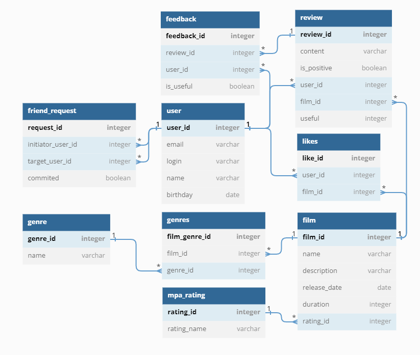

# java-filmorate
Template repository for Filmorate project.
1.ER-диаграмма
ER-диаграмма реализует минимальные требования по структуре БД.  
 
`user` 
Содержит данные пользователях: 
 
Первичный ключ `user_id` — идентификатор пользователя; 
`email`— почта; 
`login` — логин; 
`name` — ФИО; 
`birthday` — дата рождения. 
 
`friend_request` 
Содержит данные о добавлении в друзья: 
 
Первичный ключ `request_id` — идентификатор заявки; 
`initiator_user_id`— инициатор запроса; 
`target_user_id` — цель запроса; 
`confirmed` — состояние запроса. 
 
`likes` 
Содержит данные о лайках фильмов: 
 
Первичный ключ `like_id` — идентификатор лайка; 
`user_id`— идентификатор пользователя; 
`film_id` — идентификатор фильма. 
 
`film` 
Содержит данные о фильмах: 
 
Первичный ключ `film_id` — идентификатор фильма; 
`film_id`— идентификатор фильма; 
`name`— название фильма; 
`description`— описание фильма; 
`release_date`— дата релиза фильма; 
`duration`— продолжительность фильма; 
`rating` — идентификатор/название рейтинга. 
 
`mpa_rating` 
Содержит данные о рейтинге Ассоциации кинокомпаний (англ. Motion Picture Association, сокращённо МРА): 
 
Первичный ключ `rating_name` — идентификатор/название рейтинга. 
 
`film_genre` 
Содержит данные о жанре определенного фильма: 
 
Первичный ключ `film_genre_id` — идентификатор жанра фильма; 
`film_id`— идентификатор фильма; 
`genre_id`— идентификатор жанра. 
 
`genre` 
Содержит данные о жанрах фильма: 
 
Первичный ключ `genre_id` — идентификатор жанра фильма; 
`name`— название жанра фильма. 

